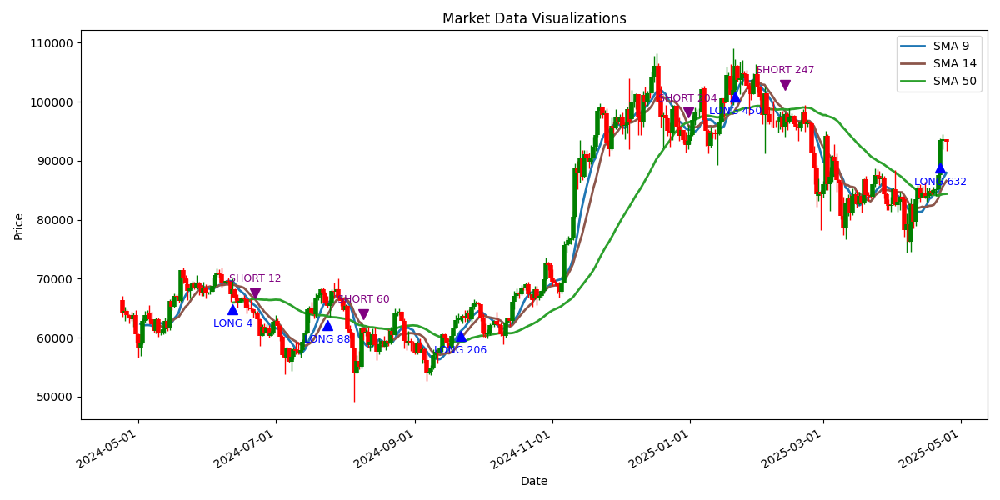

# OpenStoxlify 📈

[](https://deepwiki.com/michaelahli/openstoxlify)
[](https://www.python.org/downloads/)
[](LICENSE)

A lightweight Python library for algorithmic trading and market analysis with professional-grade visualizations.

---

## ✨ Key Features

- **Multi-source data**: Fetch from Yahoo Finance, Binance, and more
- **Strategy engine**: Record and visualize trading signals
- **Professional charts**: OHLC candles, indicators, and strategy markers
- **Flexible outputs**: Interactive plots and JSON for programmatic use

---

## 🚀 Quick Start

```python
from openstoxlify import fetch, plot, draw
from openstoxlify.models import Period, Provider

# 1. Get market data
data = fetch("AAPL", Provider.YFinance, Period.DAILY)

# 2. Plot closing prices
for quote in data.quotes:
    plot(PlotType.LINE, "Close", quote.timestamp, quote.close)

# 3. Visualize
draw()
```

---

## 📦 Installation

### Basic Installation

```bash
pip install openstoxlify
```

### For Development

```bash
git clone https://github.com/michaelahli/openstoxlify.git
cd openstoxlify
make clean setup
source venv/bin/activate
python examples/moving_average.py
```

### Requirements

| Package    | Minimum Version | Notes                           |
| ---------- | --------------- | ------------------------------- |
| Python     | 3.8+            |                                 |
| requests   | 2.25+           | For API communication           |
| matplotlib | 3.5+            | Only required for visualization |
| pandas     | 1.3+            | Recommended for data analysis   |

### Troubleshooting

1. **Missing Dependencies**:

   ```bash
   pip install --upgrade requests matplotlib pandas
   ```

2. **Permission Issues** (Linux/Mac):

   ```bash
   pip install --user openstoxlify
   ```

3. **Conda Users**:

   ```bash
   conda install -c conda-forge requests matplotlib
   pip install openstoxlify
   ```

---

## 📊 Core Components

### Market Data Fetching

```python
data = fetch(
    symbol="BTC-USD",
    provider=Provider.Binance,
    period=Period.HOURLY
)
```

**Supported Providers**:

- `YFinance` - Yahoo Finance market data
- `Binance` - Crypto data from Binance

**Available Timeframes**:

| Period     | Interval |
| ---------- | -------- |
| MINUTELY   | 1m       |
| QUINTLY    | 5m       |
| HALFHOURLY | 30m      |
| HOURLY     | 60m      |
| DAILY      | 1d       |
| WEEKLY     | 1w       |
| MONTHLY    | 1mo      |

---

### Strategy Signals

```python
act(
    action=ActionType.LONG,      # Trading decision
    timestamp=datetime.now(),    # Exact signal time  
    amount=1000                  # Position size
)
```

**Action Types**:

| Type  | Description           | Visual Marker |
| ----- | --------------------- | ------------- |
| LONG  | Buy/Bullish position  | ▲ Blue        |
| SHORT | Sell/Bearish position | ▼ Purple      |
| HOLD  | No action             | -             |

---

### Visualization

```python
plot(
    graph_type=PlotType.LINE,
    label="RSI(14)", 
    timestamp=quote.timestamp,
    value=65.7
)
```

**Plot Types**:

- `LINE`: Continuous trend lines
- `HISTOGRAM`: Volume/indicator bars  
- `AREA`: Filled regions (e.g., Bollinger Bands)

---

## 🎨 Visualization with `draw()`

The `draw()` function generates professional financial charts combining:

- Price data (OHLC candles)
- Technical indicators
- Trading signals
- Custom annotations

### Basic Usage

```python
from openstoxlify import draw

# After plotting data and strategy signals:
draw()  # Displays interactive matplotlib chart
```

### Chart Features

| Element          | Description                         | Example Visual    |
| ---------------- | ----------------------------------- | ----------------- |
| **Candlesticks** | Green/red based on price direction  | 🟩🟥                |
| **Signals**      | Annotated markers for trades        | ▲ LONG<br>▼ SHORT |
| **Indicators**   | Lines, histograms, and filled areas | ─────             |

### Customization Options

```python
# Configure before calling draw()
plt.rcParams.update({
    'figure.figsize': (14, 7),       # Larger canvas
    'lines.linewidth': 2,            # Thicker trend lines
    'font.size': 10                  # Larger annotations
})

draw()  # Now with custom styling
```

### Example Output


*(Actual chart would show:)*

- Price candles with volume
- SMA lines in different colors
- Triangle markers for entry/exit points
- Strategy annotations with position sizes

### Advanced Features

1. **Multi-panel Layouts**:

```python
# Create subplots
fig, (ax1, ax2) = plt.subplots(2, 1, height_ratios=[3,1])

# Price chart
draw(ax=ax1)  

# Volume histogram 
plot_volume(ax=ax2)  # Your custom function
plt.show()
```

2. **Save to File**:

```python
draw()
plt.savefig('strategy_backtest.png', dpi=300)
```

### Key Parameters

| Parameter | Type      | Default   | Description                               |
| --------- | --------- | --------- | ----------------------------------------- |
| `figsize` | (int,int) | (12,6)    | Chart dimensions (width,height)           |
| `style`   | str       | 'default' | Matplotlib style ('dark_background', etc) |
| `title`   | str       | None      | Custom chart title                        |

---

## 📝 API Reference

### Data Structure

```python
@dataclass
class MarketData:
    ticker: str         # "AAPL"
    period: Period      # Period.DAILY
    provider: Provider  # Provider.YFinance
    quotes: list[Quote] # OHLCV data
```

**Quote Object**:

```python
@dataclass
class Quote:
    timestamp: datetime  # Time of measurement
    open: float          # Opening price
    high: float          # Daily high  
    low: float           # Daily low
    close: float         # Closing price
    volume: float        # Trading volume
```

---

## 📚 Example Strategies

### Moving Average Crossover

```python
def ma_crossover(symbol: str, fast: int, slow: int):
    data = fetch(symbol, Period.DAILY)
    closes = [q.close for q in data.quotes]
    
    for i in range(slow, len(closes)):
        fast_ma = sum(closes[i-fast:i])/fast
        slow_ma = sum(closes[i-slow:i])/slow
        
        if fast_ma > slow_ma:
            act(ActionType.LONG, data.quotes[i].timestamp)
        else:
            act(ActionType.SHORT, data.quotes[i].timestamp)
```

---

## 💡 Tips

1. Use `output()` to export results for backtesting
2. Combine multiple plot types for rich analysis
3. All timestamps are timezone-aware UTC

---

## 📜 License

MIT © 2025 OpenStoxlify
